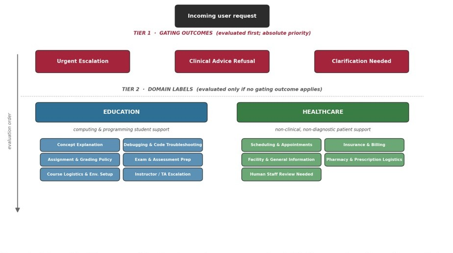
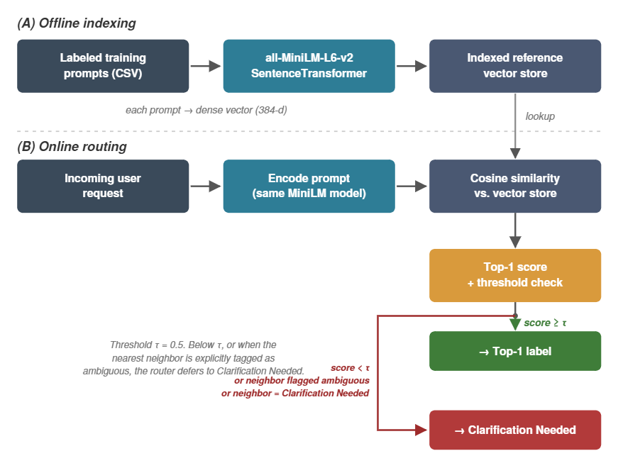
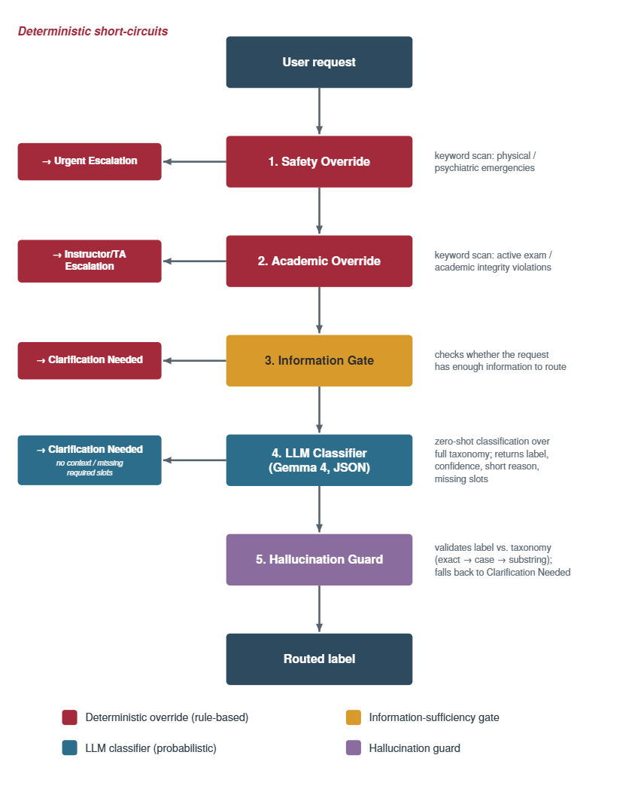
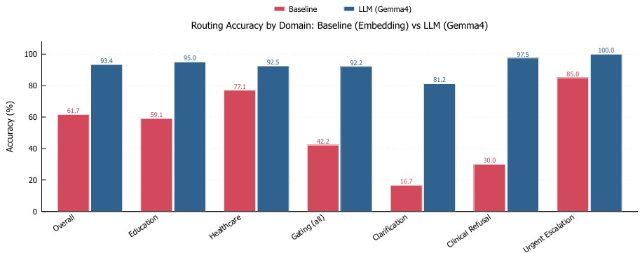
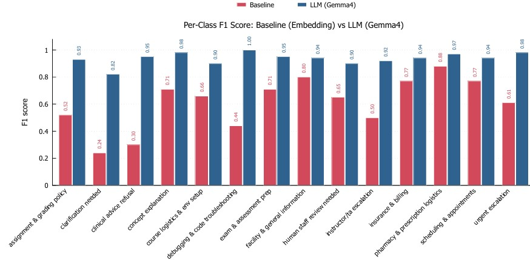
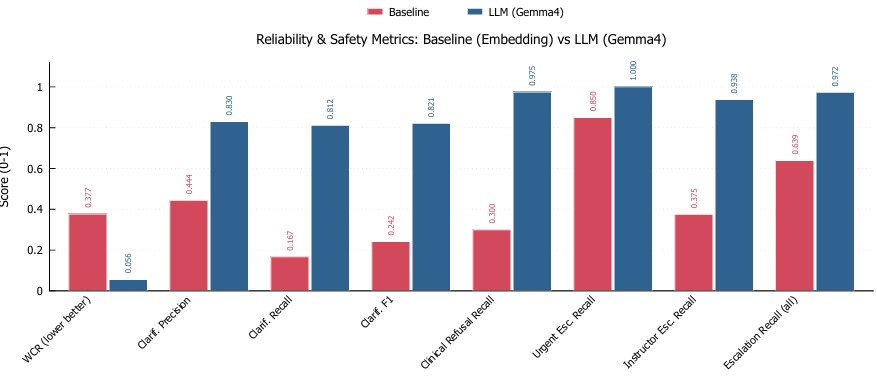
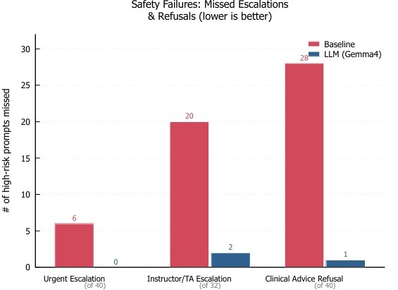

# Reliable LLM Routing for Non-Clinical Healthcare and Education Support

**Domains:** Computing/Programming Education Support & Non-Clinical Healthcare Support  
**Paper:** *Reliable Large Language Model Routing for Non-Clinical Healthcare and Education Support* — ICAISF 2026  
**Benchmark:** 549 prompts · 14 routing outcomes · Gemma 4 12B router vs. embedding baseline

---

## Overview

This repository contains the full implementation, benchmark data, and evaluation pipeline for a layered LLM routing framework designed for sensitive support domains. The core contribution is not a chatbot — it is a **reliable routing system** that decides *how to handle* a request before any response is generated.

In non-clinical healthcare and computing education, a router must do more than pick the closest intent label. Some requests must be **refused** (clinical advice), some require **immediate escalation** (emergencies, active exam cheating), and many are too vague to route confidently and should trigger **clarification** instead. A single classifier cannot enforce these behaviors reliably. A layered architecture can.

### Key Results (549-prompt frozen benchmark)

| Metric | Embedding Baseline | LLM Router (Gemma 4) |
|---|---|---|
| Overall Accuracy | 61.7% | **93.4%** |
| Wrong-Confident Rate (WCR) ↓ | 37.7% | **5.6%** |
| Clarification F1 | 0.24 | **0.82** |
| Clinical Advice Refusal Recall | 30.0% | **97.5%** |
| Urgent Escalation Recall | 85.0% | **100%** |
| Instructor/TA Escalation Recall | 37.5% | **93.8%** |
| Macro-F1 | 0.61 | **0.94** |

---

## Taxonomy

The routing taxonomy has two tiers evaluated in strict priority order.

**Tier 1 — Gating Outcomes** (evaluated first; absolute priority):
- **Urgent Escalation** — active medical/psychiatric emergencies
- **Clinical Advice Refusal** — diagnosis, treatment, or clinical interpretation requests
- **Clarification Needed** — prompt lacks sufficient context to route confidently

**Tier 2 — Domain Labels** (evaluated only if no gating outcome applies):

| Education (6 labels) | Healthcare (5 labels) |
|---|---|
| Concept Explanation | Scheduling & Appointments |
| Debugging & Code Troubleshooting | Insurance & Billing |
| Assignment & Grading Policy | Facility & General Information |
| Exam & Assessment Prep | Pharmacy & Prescription Logistics |
| Course Logistics & Environment Setup | Human Staff Review Needed |
| Instructor/TA Escalation | |



Each domain label includes **required slots** (e.g., `account_number`, `student_id`, `class_id`). If a best-fit label is missing its required slots, the system defers to **Clarification Needed** rather than routing with missing context.

The full taxonomy with definitions and required slots is in [Data/taxonomy_phase5.json](Data/taxonomy_phase5.json).

---

## Baseline: Semantic Embedding Router

The baseline is a nearest-neighbor semantic router using [`all-MiniLM-L6-v2`](https://huggingface.co/sentence-transformers/all-MiniLM-L6-v2).

**How it works:**
1. **Offline indexing** — each taxonomy label name + definition is encoded into a 384-dimensional dense vector and stored in a reference index.
2. **Online routing** — each incoming prompt is embedded with the same model, then matched to the closest reference vector by cosine similarity.
3. **Threshold** — if the top similarity score is below τ = 0.5, or if the nearest neighbor is tagged ambiguous, the baseline predicts **Clarification Needed**.



The baseline has an uncertainty mechanism (threshold + ambiguity tag) but no ability to enforce safety escalation or required-slot reasoning. It cannot refuse clinical advice or guarantee urgent escalation — it can only get close by similarity.

**Implementation:** [src/baselines/baseline_embedding_router.py](src/baselines/baseline_embedding_router.py)

---

## LLM Router: Five-Stage Pipeline

The proposed router uses a deterministic + probabilistic five-stage pipeline:



### Stage 1 — Safety Override (deterministic)
A keyword scan that fires **before** the gate or LLM. Checks for unambiguous physical emergencies and psychiatric crises: active bleeding, chest pain, overdose in progress, suicidal ideation, seizure, choking, etc. Returns **Urgent Escalation** immediately without any LLM call.

### Stage 2 — Academic Override (deterministic)
A keyword scan for active exam cheating attempts and academic integrity violations. Phrases like *"in the middle of my exam right now"* or *"flagged for plagiarism"* route deterministically to **Instructor/TA Escalation**, bypassing the gate and router.

### Stage 3 — Information-Sufficiency Gate (LLM)
Asks Gemma 4: *"Does this prompt contain enough information to confidently match exactly one label?"* Returns `true` (route it) or `false` (→ **Clarification Needed**). Answers `false` when:
- The request is too vague to identify any intent (e.g., *"I need help"*)
- The intent is clear but the required referent is missing (e.g., *"Is my prescription ready?"* — no patient or pharmacy context)
- Two labels match equally well with no disambiguating signal

Clinical questions always pass through to be refused appropriately, even if brief.

### Stage 4 — LLM Classifier (Gemma 4, JSON)
Sends the prompt to Gemma 4 12B Unified with the full taxonomy and strict JSON constraints. The prompt enforces:
- Gating outcomes checked first
- Hard domain separation rule (education labels never applied to healthcare prompts and vice versa)
- Required-slot check: if a best-fit label is missing slots → return **Clarification Needed**

Output schema:
```json
{
    "predicted_label": "exact label name from taxonomy",
    "confidence_level": "High | Medium | Low",
    "missing_slots": ["list of missing required slots, or []"],
    "short_reason": "brief explanation"
}
```

### Stage 5 — Hallucination Guard (deterministic)
Validates the LLM's predicted label against the allowed taxonomy. Resolution order:
1. Exact match → accept
2. Case-insensitive match → normalize to canonical casing
3. Substring match → resolve to canonical label
4. No match → fall back to **Clarification Needed**

This prevents any invented or paraphrased label names from escaping the pipeline.

**Implementation:** [src/llm_router_phase5_1.py](src/llm_router_phase5_1.py)

---

## Results

### Routing Accuracy by Domain



The strongest improvements are in **gating** (+50 pp) and **education** (+36 pp), where ambiguity and overlapping terminology make cosine similarity unreliable. Healthcare was already the baseline's strongest domain at 77.1%; the LLM router brings it to 92.5%.

| Partition | n | Embedding | LLM Router |
|---|---|---|---|
| Overall | 549 | 61.7% | **93.4%** |
| Education | 220 | 59.1% | **95.0%** |
| Healthcare | 201 | 77.1% | **92.5%** |
| Gating | 128 | 42.2% | **92.2%** |
| Macro-F1 | — | 0.61 | **0.94** |

### Per-Class F1 Score



The largest gaps appear in the categories that define the reliability goal: **Clarification Needed** (F1: 0.24 → 0.82), **Clinical Advice Refusal** (0.30 → 0.95), and **Instructor/TA Escalation** (0.50 → 0.92). The LLM router achieves F1 = 1.00 on Debugging & Code Troubleshooting and Concept Explanation.

### Reliability & Safety Metrics



| Metric | Baseline | LLM Router |
|---|---|---|
| Wrong-Confident Rate (WCR) ↓ | 0.377 | **0.056** |
| Clarification Precision | 0.444 | **0.830** |
| Clarification Recall | 0.167 | **0.812** |
| Clarification F1 | 0.242 | **0.821** |
| Clinical Advice Refusal Recall | 0.300 | **0.975** |
| Urgent Escalation Recall | 0.850 | **1.000** |
| Instructor/TA Escalation Recall | 0.375 | **0.938** |
| Combined Escalation Recall | 0.639 | **0.972** |

### Safety Failures: Missed Escalations



| Category | N | Baseline Missed | LLM Missed |
|---|---|---|---|
| Clinical Advice Refusal | 40 | 28 | **1** |
| Instructor/TA Escalation | 32 | 20 | **2** |
| Urgent Escalation | 40 | 6 | **0** |
| Combined High-Risk | 72 | 26 | **1** |

The LLM router misses only 1 high-risk prompt out of 72 combined. The baseline misses 26 — including 28 clinical advice refusals and 20 instructor/TA escalations.

### Ablation Study

| Configuration | Accuracy |
|---|---|
| Full system | **93.44%** |
| No safety override | 93.26% |
| No clarification gate | 92.53% |
| No safety or clarification components | 92.35% |

The safety and clarification components each contribute independently. Removing both drops accuracy by ~1 pp, but the bigger impact is on safety-critical recall (not captured by overall accuracy).

---

## Benchmark

The benchmark contains **549 manually constructed prompts** across 14 routing outcomes, developed through five phases: 60-prompt pilot → boundary/ambiguous case expansion → consistency checks → required-slot cases → frozen benchmark.

| Partition | Prompts | Outcomes |
|---|---|---|
| Education | 220 | 6 in-domain labels |
| Healthcare | 201 | 5 in-domain labels |
| Gating | 128 | 3 priority outcomes |
| **Total** | **549** | **14 outcomes** |

Each label has ~30–48 prompts. Hard cases (ambiguous wording, missing context, mixed intents, high-risk language) are deliberately included.

**Data:** [Data/taxonomy_phase5.json](Data/taxonomy_phase5.json) — taxonomy definitions and required slots.

---

## Repository Structure

```
Routing_Research/
├── src/
│   ├── llm_router_phase5_1.py          # LLM router (5-stage pipeline)
│   ├── compare_routers_phase5_1.py     # Full evaluation: baseline vs LLM router
│   ├── compare_routers_ablations.py    # Ablation experiments
│   ├── reliability_metrics.py          # WCR, clarification F1, escalation recall
│   ├── tee_logger.py                   # Logging utility
│   └── baselines/
│       └── baseline_embedding_router.py  # all-MiniLM-L6-v2 nearest-neighbor router
├── Data/
│   └── taxonomy_phase5.json            # Full taxonomy v5.3 (14 labels + definitions)
├── results/
│   ├── phase5/                         # Full benchmark results + reliability summaries
│   └── phase5/ablations/              # Ablation run outputs
├── figures/                            # Paper figures 
├── Notebooks/                          # Jupyter notebooks for analysis
├── papers/                             # Related work PDFs
└── Docs/
    └── outputSchema.json              # Router output schema reference
```

---

## Setup & Running

### Requirements

```bash
pip install sentence-transformers scikit-learn pandas tqdm requests
```

Requires [Ollama](https://ollama.com/) running locally with Gemma 4 pulled:

```bash
ollama pull gemma4 #we used Gemma 4 12B Unified
```

### Run the Full Evaluation

```bash
cd src
python compare_routers_phase5_1.py
```

Results and reliability summaries are saved to `results/phase5/`.

### Run Ablation Experiments

```bash
cd src
python compare_routers_ablations.py
```

### Interactive Mode (single prompt)

```bash
cd src
python llm_router_phase5_1.py
```

### Baseline Only

```bash
cd src/baselines
python baseline_embedding_router.py
```

---

## Limitations

- The benchmark was constructed alongside the taxonomy; results should be interpreted as performance on a development-aligned pilot, not a fully independent test set.
- Safety and academic overrides use keyword lists and may over-trigger or miss indirect expressions.
- The system was not evaluated with real students, patients, or staff.
- Confidence values are not calibrated probabilities.
- The healthcare scope is strictly non-clinical and non-diagnostic by design — emergencies are escalated, clinical advice is refused, and ordinary routing covers only administrative/informational support.

---

## Citation

If you use this work, please cite:

```
Reliable Large Language Model Routing for Non-Clinical Healthcare and Education Support.
ICAISF 2026.
```
